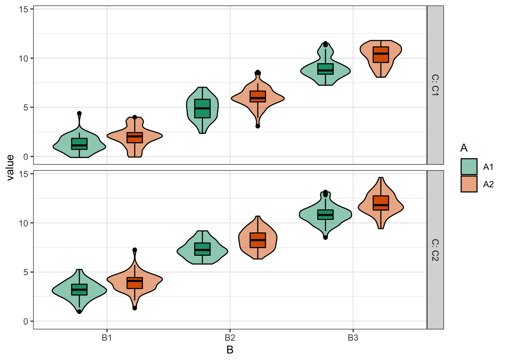

# Intro to Faux


```r
library(tidyverse)
library(faux)
library(broom)
library(afex)

set.seed(8675309) # Jenny, I've got your number
```

In this tutorial, we'll learn how to simulate data for factorial designs using {faux}. There are more extensive examples at <https://debruine.github.io/faux/>.

## Multivariate normal

You can create sets of correlated normally distributed values using `rnorm_multi()`.


```r
dat3 <- rnorm_multi(
  n = 50,
  vars = 3,
  mu = c(1, 2, 3),
  sd = c(0.5, 1, 1.5),
  r = c(0, .25, .5),
  varnames = c("A", "B", "C")
)
```

The function `get_params()` gives you a quick way to see the means, SDs and correlations in the simulated data set to make sure you set the parameters correctly.


```r
get_params(dat3)
```

<div class="kable-table">

|  n|var |    A|    B|    C| mean|   sd|
|--:|:---|----:|----:|----:|----:|----:|
| 50|A   | 1.00| 0.01| 0.31| 1.00| 0.42|
| 50|B   | 0.01| 1.00| 0.38| 1.93| 0.92|
| 50|C   | 0.31| 0.38| 1.00| 2.85| 1.31|

</div>

If you set `empirical` to `TRUE`, the values you set will be the **sample** parameters, not the **population** parameters. This isn't usually what you want for a simulation, but can be useful to check you set the parameters correctly.


```r
dat3 <- rnorm_multi(
  n = 50,
  vars = 3,
  mu = c(1, 2, 3),
  sd = c(0.5, 1, 1.5),
  r = c(0, .25, .5),
  varnames = c("A", "B", "C"),
  empirical = TRUE
)

get_params(dat3)
```

<div class="kable-table">

|  n|var |    A|   B|    C| mean|  sd|
|--:|:---|----:|---:|----:|----:|---:|
| 50|A   | 1.00| 0.0| 0.25|    1| 0.5|
| 50|B   | 0.00| 1.0| 0.50|    2| 1.0|
| 50|C   | 0.25| 0.5| 1.00|    3| 1.5|

</div>

### Shortcuts

There are a few shortcuts you can use. Run the following and see if you can guess how they work.


```r
guess1 <- rnorm_multi(50, mu = c(x = 1, y = 2, z = 3), empirical = TRUE)

get_params(guess1)
```

<div class="kable-table">

|  n|var |  x|  y|  z| mean| sd|
|--:|:---|--:|--:|--:|----:|--:|
| 50|x   |  1|  0|  0|    1|  1|
| 50|y   |  0|  1|  0|    2|  1|
| 50|z   |  0|  0|  1|    3|  1|

</div>


```r
guess2 <- rnorm_multi(50, vars = 4, r = 0.5, empirical = TRUE)

get_params(guess2)
```

<div class="kable-table">

|  n|var |  X1|  X2|  X3|  X4| mean| sd|
|--:|:---|---:|---:|---:|---:|----:|--:|
| 50|X1  | 1.0| 0.5| 0.5| 0.5|    0|  1|
| 50|X2  | 0.5| 1.0| 0.5| 0.5|    0|  1|
| 50|X3  | 0.5| 0.5| 1.0| 0.5|    0|  1|
| 50|X4  | 0.5| 0.5| 0.5| 1.0|    0|  1|

</div>


```r
iris_r <- cor(iris[, 1:4])
iris_mu <- summarise_all(iris[, 1:4], mean) %>% t()
iris_sd <- summarise_all(iris[, 1:4], sd) %>% t()

guess3 <- rnorm_multi(50, 
                      mu = iris_mu, 
                      sd = iris_sd, 
                      r = iris_r)

get_params(guess3)
```

<div class="kable-table">

|  n|var          | Sepal.Length| Sepal.Width| Petal.Length| Petal.Width| mean|   sd|
|--:|:------------|------------:|-----------:|------------:|-----------:|----:|----:|
| 50|Sepal.Length |         1.00|       -0.19|         0.84|        0.81| 6.03| 0.77|
| 50|Sepal.Width  |        -0.19|        1.00|        -0.57|       -0.49| 3.10| 0.50|
| 50|Petal.Length |         0.84|       -0.57|         1.00|        0.97| 3.90| 1.79|
| 50|Petal.Width  |         0.81|       -0.49|         0.97|        1.00| 1.25| 0.76|

</div>

You can set the r for correlations in a few different ways.

If all correlations have the same value, just set r equal to a single number.


```r
# all correlations the same value
rho_same <- rnorm_multi(50, 4, r = .5, empirical = TRUE)
get_params(rho_same)
```

<div class="kable-table">

|  n|var |  X1|  X2|  X3|  X4| mean| sd|
|--:|:---|---:|---:|---:|---:|----:|--:|
| 50|X1  | 1.0| 0.5| 0.5| 0.5|    0|  1|
| 50|X2  | 0.5| 1.0| 0.5| 0.5|    0|  1|
| 50|X3  | 0.5| 0.5| 1.0| 0.5|    0|  1|
| 50|X4  | 0.5| 0.5| 0.5| 1.0|    0|  1|

</div>

You can set rho to a vector or matrix of the full correlation matrix. This is convenient when you're getting the values from an existing dataset, where you can just use the output of the `cor()` function.


```r
# full correlation matrix
#         X1   X2   X3   X4
rho <- c(1.0, 0.5, 0.4, 0.3, # X1
         0.5, 1.0, 0.2, 0.1, # X2
         0.4, 0.2, 1.0, 0.0, # X3
         0.3, 0.1, 0.0, 1.0) # X4
rho_cormat <- rnorm_multi(50, 4, r = rho, empirical = TRUE)
get_params(rho_cormat)
```

<div class="kable-table">

|  n|var |  X1|  X2|  X3|  X4| mean| sd|
|--:|:---|---:|---:|---:|---:|----:|--:|
| 50|X1  | 1.0| 0.5| 0.4| 0.3|    0|  1|
| 50|X2  | 0.5| 1.0| 0.2| 0.1|    0|  1|
| 50|X3  | 0.4| 0.2| 1.0| 0.0|    0|  1|
| 50|X4  | 0.3| 0.1| 0.0| 1.0|    0|  1|

</div>

Alternatively, you can just specify the values from the upper right triangle of a correlation matrix. This is easier if you're reading the values out of a paper.


```r
# upper right triangle
#         X2   X3   X4
rho <- c(0.5, 0.4, 0.3, # X1
              0.2, 0.1, # X2
                   0.0) # X3

rho_urt <- rnorm_multi(50, 4, r = rho, empirical = TRUE)
get_params(rho_urt)
```

<div class="kable-table">

|  n|var |  X1|  X2|  X3|  X4| mean| sd|
|--:|:---|---:|---:|---:|---:|----:|--:|
| 50|X1  | 1.0| 0.5| 0.4| 0.3|    0|  1|
| 50|X2  | 0.5| 1.0| 0.2| 0.1|    0|  1|
| 50|X3  | 0.4| 0.2| 1.0| 0.0|    0|  1|
| 50|X4  | 0.3| 0.1| 0.0| 1.0|    0|  1|

</div>


## Factorial Designs

You can use `rnorm_multi()` to simulate data for each between-subjects cell of a factorial design and manually combine the tables, but faux has a function that better maps onto how we usually think and teach about factorial designs.

The default design is 100 observations of one variable (named `y`) with a mean of 0 and SD of 1. Unless you set `plot = FALSE` or run `faux_options(plot = FALSE)`, this function will show you a plot of your design so you can check that it looks like you expect.


```r
simdat1 <- sim_design()
```


### Factors

Use lists to set the names and levels of `within`- and `between`-subject factors.


```r
pettime <- sim_design(
  within = list(time = c("pre", "post")),
  between = list(pet = c("cat", "dog", "ferret"))
)
```


You can set `mu` and `sd` with unnamed vectors, but getting the order right can take some trial and error.


```r
pettime <- sim_design(
  within = list(time = c("pre", "post")),
  between = list(pet = c("cat", "dog", "ferret")),
  mu = 1:6
)
```


You can set values with a named vector for a single type of factor. The values do not have to be in the right order if they're named.


```r
pettime <- sim_design(
  within = list(time = c("pre", "post")),
  between = list(pet = c("cat", "dog", "ferret")),
  mu = c(cat = 1, ferret = 5, dog = 3),
  sd = c(pre = 1, post = 2)
)
```


Or use a data frame for within- and between-subject factors.


```r
pettime <- sim_design(
  within = list(time = c("pre", "post")),
  between = list(pet = c("cat", "dog", "ferret")),
  mu = data.frame(
    pre = c(1, 3, 5),
    post = c(2, 4, 6),
    row.names = c("cat", "dog", "ferret")
  )
)
```


If you have within-subject factors, set the correlations for each between-subject cell like this.


```r
pettime <- sim_design(
  within = list(time = c("pre", "post")),
  between = list(pet = c("cat", "dog", "ferret")),
  r = list(cat = 0.5,
           dog = 0.25,
           ferret = 0),
  empirical = TRUE,
  plot = FALSE
)

get_params(pettime)
```

<div class="kable-table">

|pet    |   n|var  |  pre| post| mean| sd|
|:------|---:|:----|----:|----:|----:|--:|
|cat    | 100|pre  | 1.00| 0.50|    0|  1|
|cat    | 100|post | 0.50| 1.00|    0|  1|
|dog    | 100|pre  | 1.00| 0.25|    0|  1|
|dog    | 100|post | 0.25| 1.00|    0|  1|
|ferret | 100|pre  | 1.00| 0.00|    0|  1|
|ferret | 100|post | 0.00| 1.00|    0|  1|

</div>

You can also change the name of the `dv` and `id` columns and output the data in long format. If you do this, you also need to tell `get_params()` what columns contain the between- and within-subject factors, the dv, and the id.


```r
dat_long <- sim_design(
  within = list(time = c("pre", "post")),
  between = list(pet = c("cat", "dog", "ferret")),
  id = "subj_id",
  dv = "score",
  long = TRUE,
  plot = FALSE
)

get_params(dat_long, 
           between = "pet", 
           within = "time",
           id = "subj_id",
           dv = "score",
           digits = 3)
```

<div class="kable-table">

|pet    |   n|var  |   pre|  post|   mean|    sd|
|:------|---:|:----|-----:|-----:|------:|-----:|
|cat    | 100|pre  | 1.000| 0.071| -0.001| 1.120|
|cat    | 100|post | 0.071| 1.000|  0.036| 0.875|
|dog    | 100|pre  | 1.000| 0.127| -0.036| 1.081|
|dog    | 100|post | 0.127| 1.000|  0.065| 0.976|
|ferret | 100|pre  | 1.000| 0.075|  0.072| 0.967|
|ferret | 100|post | 0.075| 1.000|  0.035| 0.936|

</div>

*The current version of faux doesn't actually need `between` or `dv` and later versions won't need `within` or `id` if a data frame was created with faux.*

### Anonymous Factors

If you need to make a quick demo, you can set factors anonymously with integer vectors. For example, the following code makes 3B\*2B\*2W mixed design.


```r
dat_anon <- sim_design(
  n = 50,
  between = c(3, 2),
  within = 2,
  mu = 1:12
)
```


Faux has a quick plotting function for visualising data made with faux. The plot created by `sim_design()` shows the *design*, while this function shows the simulated *data*.


```r
plot(dat_anon)
```


You can change the order of plotting and the types of geoms plotted. This takes a little trial and error, so this function will probably be refined in later versions.


```r
plot(dat_anon, "B", "A", "C", geoms = c("violin", "pointrangeSD"))
```


## Replications

You often want to simulate data repeatedly to do things like calculate power. The `sim_design()` function has a lot of overhead for checking if a design makes sense and if the correlation matrix is possible, so you can speed up the creation of multiple datasets with the same design using the `rep` argument. This will give you a nested data frame with each dataset in the `data` column. 


```r
dat_rep <- sim_design(
  within = 2,
  n = 20,
  mu = c(0, 0.25),
  rep = 5,
  plot = FALSE
)
```

### Analyse each replicate

You can run analyses on the nested data by wrapping your analysis code in a function then using `map()` to run the analysis on each data set and `unnest()` to expand the results into a data table.


```r
analyse <- function(data) {
  t.test(data$A1, data$A2, paired = TRUE) %>% broom::tidy()
}

dat_rep %>%
  mutate(analysis = map(data, analyse)) %>%
  select(-data) %>%
  unnest(analysis)
```

<div class="kable-table">

| rep|   estimate|  statistic|   p.value| parameter|   conf.low| conf.high|method        |alternative |
|---:|----------:|----------:|---------:|---------:|----------:|---------:|:-------------|:-----------|
|   1| -0.1311559| -0.4271395| 0.6740791|        19| -0.7738319| 0.5115202|Paired t-test |two.sided   |
|   2| -0.2684812| -1.1258509| 0.2742492|        19| -0.7676038| 0.2306414|Paired t-test |two.sided   |
|   3| -0.3040475| -0.9078698| 0.3753187|        19| -1.0050056| 0.3969106|Paired t-test |two.sided   |
|   4| -0.5503311| -1.9942297| 0.0606779|        19| -1.1279257| 0.0272635|Paired t-test |two.sided   |
|   5| -0.1431282| -0.4865269| 0.6321583|        19| -0.7588616| 0.4726051|Paired t-test |two.sided   |

</div>

### ANOVA

Use the same pattern to run an ANOVA on a version of the `pettime` dataset.

First, simulate 100 datasets in long format. These data will have small main effects of pet and time, but no interaction.


```r
pettime100 <- sim_design(
  within = list(time = c("pre", "post")),
  between = list(pet = c("cat", "dog")),
  n = c(cat = 50, dog = 40),
  mu = data.frame(
    pre = c(1, 1.2),
    post = c(1.2, 1.4),
    row.names = c("cat", "dog")
  ),
  sd = 1,
  id = "pet_id",
  dv = "score",
  r = 0.5,
  long = TRUE,
  rep = 100
)
```


Then set up your analysis. We'll use the `aov_ez()` function from the {afex} package because its arguments match those of `sim_design()`.


```r
afex::set_sum_contrasts() # avoids annoying afex message
```

```
## setting contr.sum globally: options(contrasts=c('contr.sum', 'contr.poly'))
```

```r
afex_options(include_aov = FALSE) # runs faster
afex_options(es_aov = "pes") # changes effect size measure to partial eta squared

analyse <- function(data) {
  a <- afex::aov_ez(
    id = "pet_id",
    dv = "score",
    between = "pet",
    within = "time",
    data = data
  ) 
  # return anova_table for GG-corrected DF
  as_tibble(a$anova_table, rownames = "term") %>%
    mutate(term = factor(term, levels = term)) %>% # keeps terms in order
    rename(p.value = `Pr(>F)`) # fixes annoying p.value name
}
```

Make a table of the results of each analysis:


```r
pettime_sim <- pettime100 %>%
  mutate(analysis = map(data, analyse)) %>%
  select(-data) %>%
  unnest(analysis)
```

<div class="kable-table">

| rep|term     | num Df| den Df|   MSE|      F|   pes| p.value|
|---:|:--------|------:|------:|-----:|------:|-----:|-------:|
|   1|pet      |      1|     88| 1.416|  0.667| 0.008|   0.416|
|   1|time     |      1|     88| 0.534|  0.544| 0.006|   0.463|
|   1|pet:time |      1|     88| 0.534|  0.035| 0.000|   0.852|
|   2|pet      |      1|     88| 1.178|  2.442| 0.027|   0.122|
|   2|time     |      1|     88| 0.498| 11.016| 0.111|   0.001|
|   2|pet:time |      1|     88| 0.498|  1.820| 0.020|   0.181|

</div>

Then you can summarise the data to calculate things like power for each effect or mean effect size.


```r
pettime_sim %>%
  group_by(term) %>%
  summarise(power = mean(p.value < 0.05),
            mean_pes = mean(pes),
            .groups = "drop")
```

<div class="kable-table">

|term     | power|  mean_pes|
|:--------|-----:|---------:|
|pet      |  0.15| 0.0212741|
|time     |  0.37| 0.0424412|
|pet:time |  0.03| 0.0089845|

</div>

The power for the between-subjects effect of pet is smaller than for the within-subjects effect of time. What happens if you reduce the correlation between pre and post?

